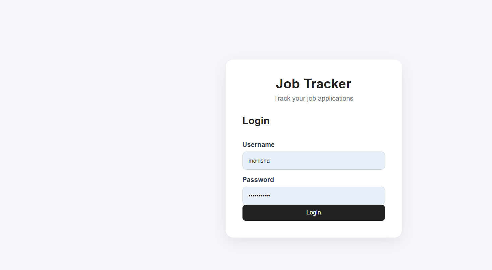
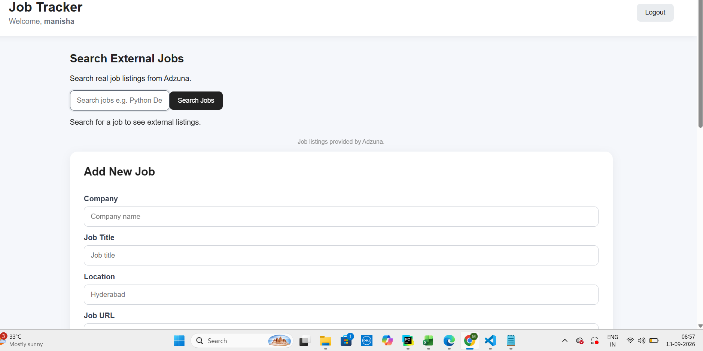
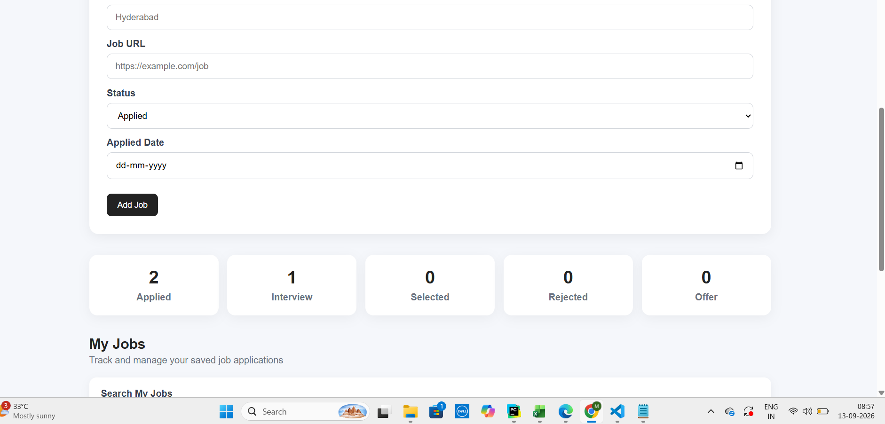
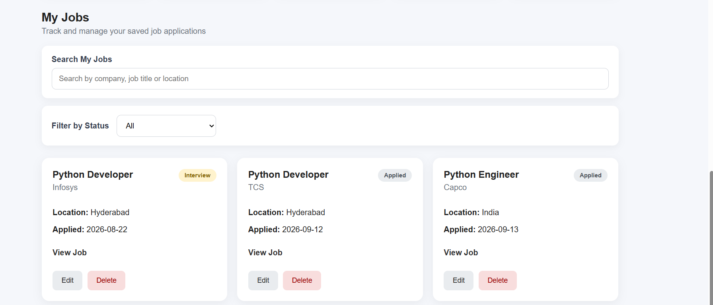
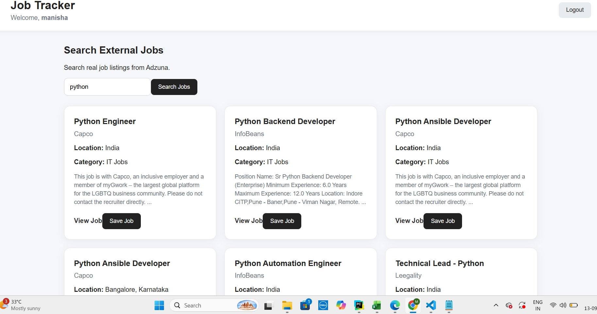

# Job Tracker - Full Stack Application

A full-stack Job Tracker application built with React, Django REST Framework, and SQLite.

The application allows users to manage their job applications, track application status, and search for real-world job listings using the Adzuna Jobs API.

## Overview

This project was built to practice and demonstrate practical full-stack development concepts, especially:

- React frontend development
- Django backend development
- REST API development
- Frontend-to-backend API integration
- User authentication
- CRUD operations
- Database management
- External API integration
- Git and GitHub workflow

## Features

### User Authentication

- User registration
- User login
- Session-based authentication
- Protected job APIs

### Job Application Tracking

Users can:

- Add job applications
- View their saved jobs
- Update job application details
- Delete job applications
- Track application status
- Store application dates
- Store job URLs

### Job Status Tracking

The application supports job statuses such as:

- Applied
- Interview
- Selected
- Rejected

The dashboard also provides a summary of job application statuses.

### External Job Search

The application integrates with the Adzuna Jobs API to search for real job listings.

Users can:

- Search for jobs using keywords
- View job titles
- View companies
- View locations
- View job descriptions
- Open the original job listing
- Save an external job to their personal Job Tracker

## Application Screenshots

### Login



### Dashboard





### My Jobs



### External Job Search



## Technology Stack

### Frontend

- React
- JavaScript
- HTML
- CSS
- Vite

### Backend

- Python
- Django
- Django REST Framework

### Database

- SQLite

### APIs

- Django REST APIs
- Adzuna Jobs API

### Tools

- Git
- GitHub
- Visual Studio Code

## Project Structure

```text
Copilot/
│
├── job-tracker/
│   ├── accounts/
│   ├── jobs/
│   ├── config/
│   ├── manage.py
│   ├── requirements.txt
│   └── .env
│
├── job-tracker-frontend/
│   ├── src/
│   │   ├── App.jsx
│   │   ├── App.css
│   │   └── index.css
│   ├── package.json
│   └── vite.config.js
│
└── screenshots/
    ├── login.png
    ├── dashboard-1.png
    ├── dashboard-2.png
    ├── my-jobs.png
    └── external-jobs.png